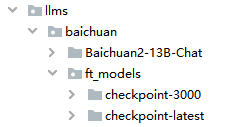

<h1 align="center">Open LLMS Next Web</h1>

一键免费部署你的私人 Open-LLMS-Next-Web 网页应用，适用于开源离线大模型的Next Web。本项目适用于没有ChatGPT资源，而想使用ChatGPT-Next-Web界面的用户，将多个开源大模型（如：百川，ChatGLM）作为Next-Web界面的后端，并实现了与ChatGPT-Next-Web一致的接口。

### 简单使用

- 本地用户的简单使用

```
pip install -r req.txt
python main.py
```
启动ChatGPT-Next-Web，请查看chatgpt-next-web目录

- 服务器用户的部署（可CPU部署，自动识别是否有GPU）

compose一键部署
```
docker compose -f main_compose.yml up
```
后台部署请加`-d`即可。

### 可支持的本地离线开源模型

以中文大模型为主，现集成的大模型如下：
- Baichuan2-13B-Chat
- ChatGLM3-6B

后续看用户的反映再去集成相关开源模型，请提issues。

### 可加载PEFT模型
可自动加载微调后的PEFT模型，请将微调后的checkpoint放到模型目录中，具体目录如图所示：


### 如何添加新的模型
请查看[utils.py](./utils.py)文件，如想添加qwen模型，请添加一个函数`def get_qwen()`去加载模型，并在`get_models()`函数中加上qwen模型的映射即可。

### 申明

- 本项目完全借鉴于ChatGLM3中的开源代码[openai_api.py](https://github.com/THUDM/ChatGLM3/blob/main/openai_api_demo/openai_api.py)；
- 本项目使用的前端是[ChatGPT-Next-Web](https://github.com/Yidadaa/ChatGPT-Next-Web)；
- 感谢以上两个项目作者的无私奉献。

### 使用问题请联系我

遇到使用的BUG或困难请联系我，也可以提issues，微信联系请注明来由。


